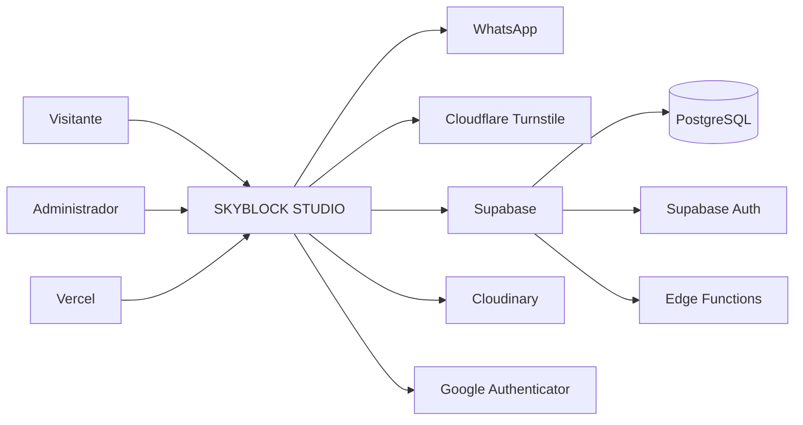
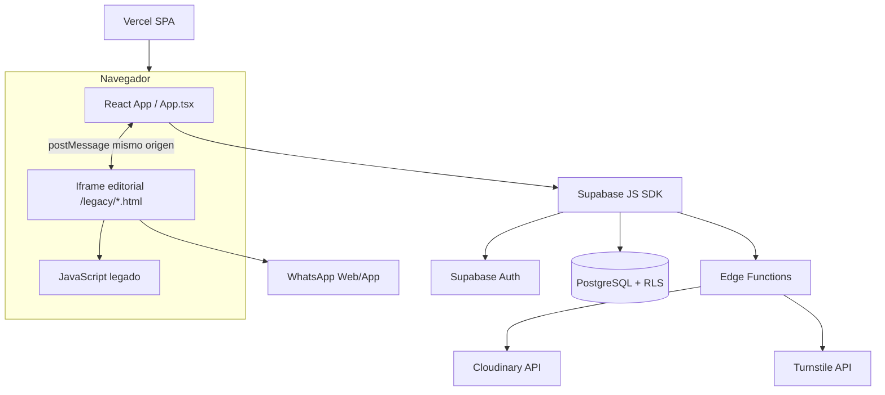
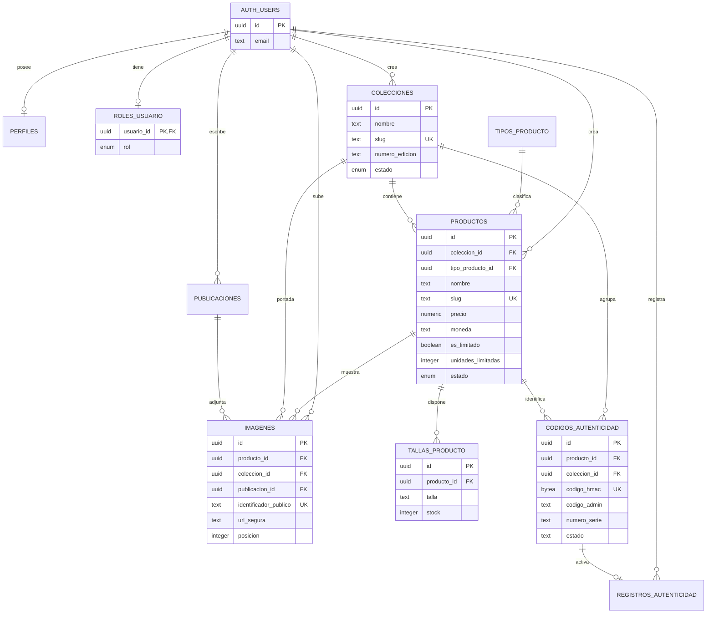
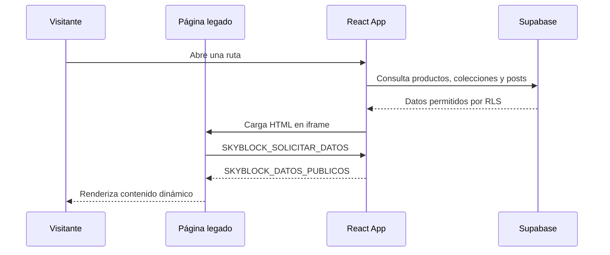
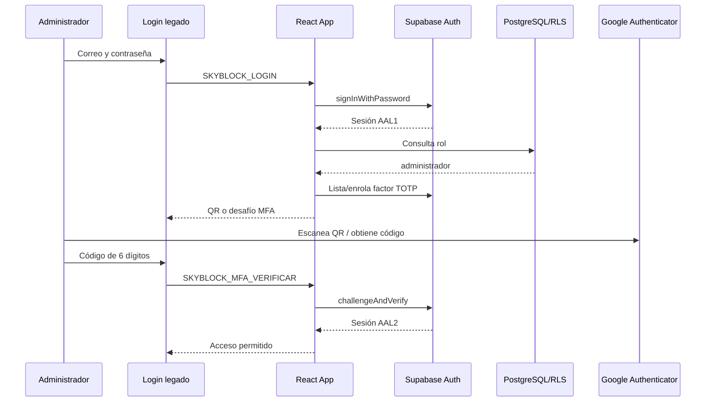
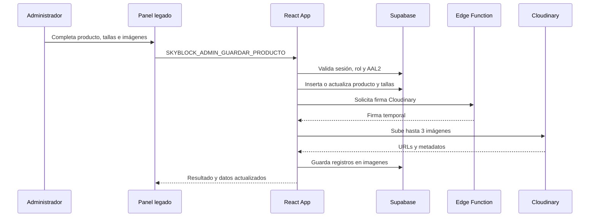
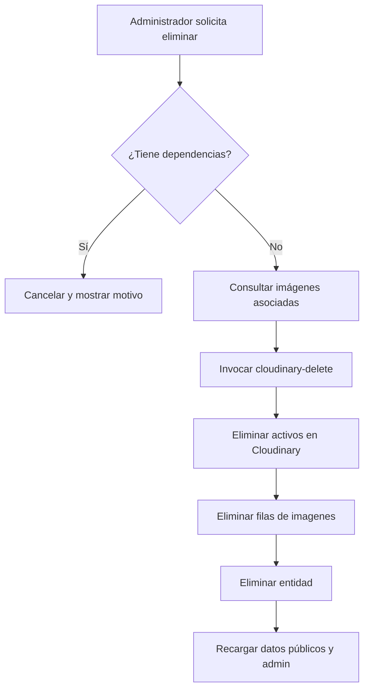
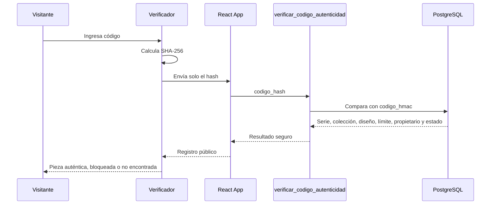
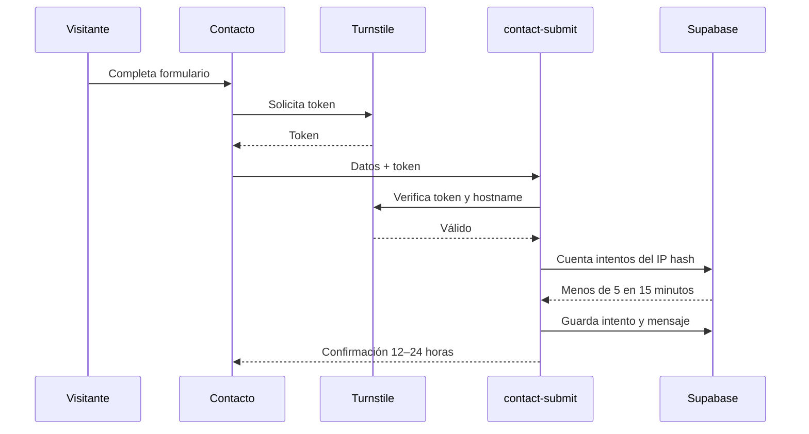
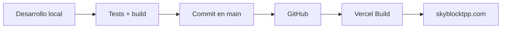

# Documentación completa de SKYBLOCK STUDIO

**Versión documentada:** septiembre de 2026  
**Repositorio:** `JoshoSysX/SKYBLOCK`  
**Rama principal:** `main`  
**Dominio de producción:** `https://www.skyblocktpp.com`  
**Última revisión técnica:** commit `324df84` (`Optimiza carrusel de colecciones en móvil`)

---

## 1. Resumen ejecutivo

SKYBLOCK STUDIO es una plataforma web para una marca de ropa urbana de ediciones limitadas nacida en Tarapoto, Perú. El sistema combina un sitio público editorial, un catálogo conectado a base de datos, un verificador de autenticidad por código, contacto protegido contra abuso y un panel administrativo privado.

La solución utiliza React, TypeScript y Vite como aplicación principal; páginas HTML/CSS/JavaScript editoriales integradas mediante un `iframe` del mismo origen; Supabase para autenticación, PostgreSQL, políticas RLS y funciones Edge; Cloudinary para almacenar imágenes; Cloudflare Turnstile para proteger el formulario de contacto; y Vercel para publicación.

### Objetivos del sistema

- Mostrar la identidad, historia y colecciones de SKYBLOCK STUDIO.
- Publicar productos, tallas, stock, precios en soles e imágenes.
- Gestionar prendas limitadas y el máximo de códigos por diseño.
- Verificar públicamente la autenticidad de una prenda sin exponer el código original.
- Permitir consultas de disponibilidad por WhatsApp con producto y talla.
- Publicar contenido editorial y novedades desde el panel.
- Administrar colecciones, productos, códigos, posts y mensajes.
- Proteger las funciones administrativas mediante rol, sesión y MFA TOTP.
- Eliminar de Cloudinary los archivos que dejan de usarse.
- Facilitar indexación en Google mediante SEO técnico.

---

## 2. Alcance actual

### Incluido

- Sitio público adaptable a escritorio, tableta y móvil.
- Inicio editorial con productos destacados y beneficios.
- Catálogo con filtro, búsqueda, ordenamiento y estado bloqueado.
- Detalle de producto con una imagen principal y hasta dos secundarias.
- Tallas disponibles, stock por talla y stock total calculado.
- Consulta por WhatsApp con información de producto y talla seleccionada.
- Colecciones publicadas y colección próxima.
- Carrusel de colecciones con controles, teclado y gestos móviles.
- Historia de la marca organizada por etapas desplegables.
- Posts dinámicos.
- Página de contacto con Turnstile y límite de solicitudes.
- Verificador público de códigos de autenticidad.
- Inicio de sesión y segundo factor con Google Authenticator.
- Panel administrativo con CRUD de contenido.
- Imágenes de hasta 150 MB y carga fragmentada para archivos grandes.
- Eliminación sincronizada de imágenes en Cloudinary.
- SEO, sitemap, robots, canonical y datos estructurados.
- Despliegue como SPA en Vercel.

### No incluido o pendiente de consolidación

- Carrito y pago en línea.
- Gestión de pedidos y facturación.
- Envío automático de mensajes de WhatsApp; el cliente confirma el envío.
- Recuperación administrativa formal de MFA.
- Endpoint de correo `/api/send-email` operativo en producción.
- Automatización completa de respaldos y restauración.
- Pruebas end-to-end amplias para todos los flujos administrativos.

---

## 3. Actores

### Visitante

- Navega por inicio, catálogo, colecciones, posts e historia.
- Consulta productos, tallas y disponibilidad.
- Abre WhatsApp con un mensaje preparado.
- Envía el formulario de contacto.
- Verifica un código de autenticidad.

### Cliente autenticado

- Dispone de una sesión de Supabase Auth.
- Puede consultar información pública y su perfil cuando corresponda.
- No obtiene permisos administrativos por estar autenticado.

### Administrador

- Requiere usuario autenticado, rol `administrador` o `superadministrador` y sesión MFA `aal2`.
- Gestiona productos, tipos, colecciones, códigos, posts y mensajes.
- Carga y elimina imágenes mediante funciones protegidas.

### Servicios externos

- **Supabase:** autenticación, PostgreSQL, RLS, RPC y Edge Functions.
- **Cloudinary:** almacenamiento y eliminación de imágenes.
- **Cloudflare Turnstile:** validación anti-bot del contacto.
- **WhatsApp:** canal de consulta iniciado por el visitante.
- **Vercel:** hosting, redirects, rewrites y entrega del frontend.
- **Google Authenticator:** generación de códigos TOTP para MFA.

---

## 4. Requisitos funcionales

### RF-01 Navegación pública

El sistema debe ofrecer las rutas `/`, `/catalogo`, `/colecciones`, `/coleccion`, `/producto`, `/posts`, `/nosotros`, `/contacto`, `/verificar`, `/privacidad` y `/terminos`.

### RF-02 Catálogo dinámico

El catálogo debe consultar Supabase y mostrar productos con estado `publicado` o `archivado`. Los archivados se presentan como bloqueados y no deben abrirse como productos disponibles.

### RF-03 Búsqueda, filtro y ordenamiento

El visitante debe poder filtrar por tipo, buscar por nombre y ordenar por precio o nombre.

### RF-04 Detalle de producto

Cada producto debe mostrar nombre, precio en PEN, descripción, materiales, colección, condición limitada, tallas y galería.

### RF-05 Galería de producto

El administrador puede cargar una imagen principal y dos secundarias. Cada archivo admite hasta 150 MB.

### RF-06 Stock por talla

El administrador selecciona una o varias tallas y define el stock de cada una. El stock total se calcula como suma de tallas.

### RF-07 Prenda limitada

El campo `unidades_limitadas` aparece únicamente cuando `es_limitado` está activo. La cantidad limitada no puede ser inferior al stock total ni a la cantidad de códigos ya creados.

### RF-08 Consulta por WhatsApp

El botón de disponibilidad debe exigir talla cuando corresponda y abrir WhatsApp con un mensaje que incluya producto y talla. El usuario pulsa Enviar dentro de WhatsApp.

### RF-09 Colecciones

El administrador puede crear, editar, publicar y archivar colecciones. No se puede eliminar una colección que tenga productos o códigos asociados.

### RF-10 Producto

El administrador puede crear, editar, bloquear y eliminar productos. No se puede eliminar un producto que tenga códigos asociados.

### RF-11 Imágenes

Las imágenes se suben a Cloudinary con una firma generada por una Edge Function. Al reemplazar o borrar una entidad, los activos anteriores deben eliminarse de Cloudinary y de la tabla `imagenes`.

### RF-12 Códigos de autenticidad

Cada código se asocia a una colección y un diseño. La serie usa el formato `n/total`, donde `total` debe coincidir con `unidades_limitadas` del producto.

### RF-13 Verificación pública

El navegador calcula SHA-256 del código ingresado y envía únicamente el hash a la función RPC. El resultado puede mostrar serie, colección, diseño, límite, propietario y estado.

### RF-14 Posts

El administrador puede crear, editar y eliminar publicaciones con imagen, texto alternativo, título y descripción.

### RF-15 Contacto

El formulario debe validar campos, exigir Turnstile, aceptar solo orígenes autorizados y limitar a cinco intentos por IP anonimizada cada quince minutos.

### RF-16 Acceso administrativo

El panel solo se habilita para una sesión autenticada con rol autorizado y nivel `aal2`.

### RF-17 MFA

El administrador puede registrar, desafiar o renovar un factor TOTP identificado como `Admin SKYBLOCK`.

### RF-18 SEO

Cada ruta debe configurar título, descripción, canonical, robots y Open Graph. Las rutas privadas deben usar `noindex,nofollow`.

---

## 5. Requisitos no funcionales

### Seguridad

- RLS habilitado en tablas de negocio.
- Secretos exclusivamente en Supabase Edge Functions o servicios de servidor.
- MFA obligatorio para operaciones administrativas.
- Validación de origen en mensajes `postMessage`.
- Códigos públicos comparados por hash SHA-256/HMAC almacenado.
- Turnstile y rate limiting para contacto.
- Identificadores Cloudinary limitados al prefijo `skyblock-studio/`.

### Rendimiento

- Carga paralela de productos, colecciones y publicaciones.
- Caché semanal para activos editoriales en Vercel.
- Índices PostgreSQL para estados, fechas, colección y contacto.
- Carga fragmentada de imágenes mayores de 100 MB en bloques de 20 MB.

### Usabilidad

- Interfaz responsive.
- Panel administrativo con tipografía aumentada.
- Estados vacíos cuando no hay contenido.
- Confirmaciones visuales personalizadas para acciones destructivas.
- Navegación móvil y carrusel compatible con gestos.

### Accesibilidad

- Uso de textos alternativos.
- Controles con etiquetas y estados deshabilitados.
- Soporte de teclado en tarjetas y carrusel.
- Respeto de `prefers-reduced-motion` en estilos modernos.

### Mantenibilidad

- TypeScript en la capa React.
- Migraciones SQL versionadas.
- Edge Functions separadas por responsabilidad.
- Contrato explícito de eventos entre React y el frontend legado.

---

## 6. Arquitectura

### 6.1 Diagrama de contexto



### 6.2 Diagrama de componentes



### 6.3 Patrón híbrido de interfaz

La aplicación React determina la ruta pública, carga datos, controla autenticación y ejecuta operaciones privilegiadas. La interfaz editorial se mantiene en páginas HTML dentro de `public/legacy`. React las muestra en un `iframe` del mismo origen y ambas capas intercambian eventos mediante `window.postMessage`.

Esto permite conservar el diseño histórico sin mover operaciones sensibles al JavaScript legado.

---

## 7. Estructura del repositorio

```text
skyblock-studio-app/
├── src/
│   ├── App.tsx                 # Orquestador, datos, auth, MFA y CRUD
│   ├── lib/supabase.ts         # Cliente público de Supabase
│   ├── pages/                  # Componentes React alternativos
│   ├── components/             # Layout y tarjetas React
│   └── index.css               # Estilos de la capa React
├── public/
│   ├── legacy/
│   │   ├── *.html              # Sitio editorial y panel
│   │   ├── css/styles.css      # Sistema visual principal
│   │   ├── js/*.js             # Interacciones por página
│   │   └── assets/image/       # Activos estáticos
│   ├── robots.txt
│   └── sitemap.xml
├── supabase/
│   ├── migrations/             # Esquema y evolución PostgreSQL
│   └── functions/              # Edge Functions
├── docs/                       # Documentación del proyecto
├── vercel.json                 # Rewrites, redirects y caché
├── vite.config.ts
└── package.json
```

---

## 8. Rutas y módulos

| Ruta | Página legado | Función |
|---|---|---|
| `/` o `/inicio` | `inicio.html` | Portada, beneficios y destacados |
| `/catalogo` | `catalogo.html` | Productos, filtros y búsqueda |
| `/producto?id=slug` | `producto.html` | Detalle, tallas, galería y WhatsApp |
| `/colecciones` | `colecciones.html` | Carrusel, archivo y próxima colección |
| `/coleccion?id=slug` | `coleccion.html` | Historia y productos de una colección |
| `/posts` | `posts.html` | Diario y publicaciones |
| `/nosotros` | `nosotros.html` | Identidad e historia por etapas |
| `/contacto` | `contacto.html` | Datos de contacto y formulario |
| `/verificar` | `verificar.html` | Autenticidad de prendas |
| `/login` | `login.html` | Acceso y MFA |
| `/registro` | `registro.html` | Registro de cuenta |
| `/admin` | `admin.html` | Gestión privada |
| `/privacidad` | `privacidad.html` | Política de privacidad |
| `/terminos` | `terminos.html` | Términos y condiciones |

---

## 9. Modelo de datos

### 9.1 Diagrama entidad-relación



### 9.2 Diccionario resumido

| Tabla | Propósito | Acceso público |
|---|---|---|
| `perfiles` | Perfil visible del usuario | Solo propietario |
| `roles_usuario` | Rol de aplicación | Solo propio; administración protegida |
| `tipos_producto` | Categorías del catálogo | Lectura |
| `colecciones` | Colecciones, historia y edición | Solo publicadas |
| `productos` | Productos y condición limitada | Publicados y archivados según política vigente |
| `tallas_producto` | Tallas y stock | Productos visibles |
| `publicaciones` | Posts editoriales | Publicados y con fecha válida |
| `imagenes` | Metadatos Cloudinary | Imágenes de entidades visibles |
| `codigos_autenticidad` | Códigos, serie y propietario | Sin lectura directa pública |
| `registros_autenticidad` | Registro de propiedad | Propietario |
| `mensajes_contacto` | Mensajes recibidos | Escritura solo por Edge Function |
| `contacto_intentos` | Rate limiting anonimizado | Solo `service_role` |
| `plantillas_correo` | Plantillas futuras | Administración |
| `registros_correo` | Auditoría de envíos | Administración |
| `registros_auditoria_admin` | Auditoría administrativa | Administración |

### 9.3 Reglas de integridad importantes

- Un producto limitado requiere `unidades_limitadas` mayor que cero.
- Una talla no puede tener stock negativo.
- Una imagen pertenece exactamente a producto, colección o publicación.
- El `identificador_publico` debe comenzar con `skyblock-studio/`.
- Una serie es única dentro del producto.
- El código administrativo tiene entre 1 y 32 caracteres si existe.
- Los estados de contenido son `borrador`, `publicado` y `archivado`.
- Los roles son `cliente`, `administrador` y `superadministrador`.

---

## 10. Flujos principales

### 10.1 Carga pública



### 10.2 Inicio de sesión administrativo con MFA



### 10.3 Guardado de producto e imágenes



### 10.4 Eliminación sincronizada



### 10.5 Verificación de autenticidad



### 10.6 Formulario de contacto



---

## 11. Contrato React ↔ interfaz legado

Los eventos más importantes son:

| Evento | Dirección | Propósito |
|---|---|---|
| `SKYBLOCK_SOLICITAR_DATOS` | Legado → React | Pedir datos públicos |
| `SKYBLOCK_DATOS_PUBLICOS` | React → Legado | Productos, colecciones y posts |
| `SKYBLOCK_ESTADO_AUTH` | React → Legado | Estado de sesión y admin |
| `SKYBLOCK_LOGIN` | Legado → React | Iniciar sesión |
| `SKYBLOCK_MFA_REQUERIDO` | React → Legado | Mostrar registro o desafío MFA |
| `SKYBLOCK_MFA_VERIFICAR` | Legado → React | Comprobar TOTP |
| `SKYBLOCK_VERIFICAR_CODIGO` | Legado → React | Consultar autenticidad |
| `SKYBLOCK_ADMIN_DATOS` | React → Legado | Datos administrativos |
| `SKYBLOCK_ADMIN_GUARDAR_PRODUCTO` | Legado → React | Crear/editar producto |
| `SKYBLOCK_ADMIN_ELIMINAR_PRODUCTO` | Legado → React | Eliminar producto seguro |
| `SKYBLOCK_ADMIN_GUARDAR_COLECCION` | Legado → React | Crear/editar colección |
| `SKYBLOCK_ADMIN_GUARDAR_CODIGO` | Legado → React | Crear/editar código |
| `SKYBLOCK_ADMIN_GUARDAR_POST` | Legado → React | Publicar post |
| `SKYBLOCK_CONTACTO` | Legado → React | Enviar formulario protegido |

Todos los receptores deben comprobar `event.origin === location.origin`.

---

## 12. Seguridad

### Implementado

- Políticas RLS en tablas principales.
- Permisos administrativos basados en rol y MFA `aal2`.
- TOTP con emisor `Admin SKYBLOCK`.
- QR estético y renovación de factores antiguos.
- Consulta pública de autenticidad mediante RPC de alcance limitado.
- Hash del código calculado en cliente; el código original no se envía como texto a la RPC.
- Código administrativo visible solo bajo política de administrador.
- Turnstile, lista de orígenes y rate limiting para contacto.
- Claves Cloudinary solo en Edge Functions.
- Validación del prefijo Cloudinary antes de eliminar.
- Restricciones de tamaño, formato lógico y relaciones en base de datos.
- Rutas privadas con `noindex,nofollow` y exclusión en `robots.txt`.

### Recomendaciones pendientes

- Cambiar el CORS `*` de las funciones Cloudinary por los dominios exactos.
- Validar explícitamente `aal2` dentro de las funciones Cloudinary, no solo rol.
- Añadir CSP, HSTS, `X-Content-Type-Options`, `Referrer-Policy` y `Permissions-Policy` en Vercel.
- Habilitar protección de contraseñas filtradas en Supabase Auth.
- Implementar recuperación operativa de MFA con procedimiento documentado.
- Añadir rate limiting a la RPC pública de autenticidad.
- Revisar minimización del nombre de propietario mostrado públicamente.
- Registrar todas las mutaciones en `registros_auditoria_admin`.
- Convertir el guardado de producto, tallas y códigos en transacciones del servidor para evitar condiciones de carrera.
- Restringir tipos MIME reales y dimensiones de imágenes antes de subir.

---

## 13. Variables de entorno

### Frontend Vite

```dotenv
VITE_SUPABASE_URL=https://TU-PROYECTO.supabase.co
VITE_SUPABASE_PUBLISHABLE_KEY=TU_CLAVE_PUBLICA
VITE_TURNSTILE_SITE_KEY=TU_SITE_KEY
```

Estas variables son públicas porque se incorporan al bundle del navegador.

### Supabase Edge Functions

```dotenv
SUPABASE_URL=https://TU-PROYECTO.supabase.co
SUPABASE_ANON_KEY=...
SUPABASE_PUBLISHABLE_KEYS={"default":"..."}
SUPABASE_SERVICE_ROLE_KEY=...
CLOUDINARY_CLOUD_NAME=...
CLOUDINARY_API_KEY=...
CLOUDINARY_API_SECRET=...
CLOUDINARY_UPLOAD_PRESET=...
TURNSTILE_SECRET_KEY=...
```

Nunca se deben guardar secretos en archivos `VITE_*`, GitHub o código cliente.

---

## 14. Instalación local

### Requisitos

- Node.js 22 o superior.
- npm.
- Proyecto Supabase configurado.
- Cuenta Cloudinary.
- Widget Cloudflare Turnstile.

### Pasos

```bash
npm install
npm run dev
```

La aplicación queda disponible normalmente en `http://127.0.0.1:5173`.

### Validación

```bash
npm test
npm run lint
npm run build
```

---

## 15. Configuración de Supabase

1. Crear un proyecto Supabase.
2. Aplicar las migraciones en orden cronológico desde `supabase/migrations`.
3. Crear un usuario y confirmar su correo.
4. Insertar su UUID en `roles_usuario` con rol `superadministrador` desde SQL Editor.
5. Configurar Site URL y redirect URLs exactas.
6. Publicar las funciones `cloudinary-signature`, `cloudinary-delete` y `contact-submit`.
7. Registrar secretos de Edge Functions.
8. Iniciar sesión y completar el registro MFA.

### Regla administrativa

Una operación administrativa solo pasa RLS si:

```text
usuario autenticado
AND rol IN ('administrador', 'superadministrador')
AND JWT aal = 'aal2'
```

---

## 16. Despliegue en Vercel

1. Conectar el repositorio de GitHub.
2. Seleccionar el directorio del proyecto.
3. Configurar las variables `VITE_*` para Production, Preview y Development según necesidad.
4. Usar `npm run build` como build command.
5. Publicar `dist` como output.
6. Asociar `skyblocktpp.com` y `www.skyblocktpp.com`.
7. Verificar que `vercel.json` aplique rewrites SPA y redirects desde `/legacy/*.html`.
8. Confirmar `robots.txt`, `sitemap.xml`, canonical y Google Search Console.

### Flujo de entrega



---

## 17. Operación del panel

### Productos

1. Abrir Productos.
2. Crear o editar nombre, tipo, colección, precio y descripción.
3. Seleccionar tallas y asignar stock.
4. Activar `Prenda limitada` si corresponde.
5. Definir el máximo de unidades del diseño.
6. Cargar una imagen principal y hasta dos secundarias.
7. Publicar o marcar como bloqueado.

### Colecciones

1. Crear nombre, edición, descripción e historia.
2. Cargar portada.
3. Definir estado publicado, próximo o borrador.
4. Eliminar únicamente si no tiene productos ni códigos asociados.

### Códigos

1. Seleccionar colección y producto.
2. Ingresar código administrativo.
3. Generar/guardar hash y últimos cuatro caracteres.
4. Definir serie `n/total` y propietario opcional.
5. Bloquear o anular cuando sea necesario.

### Posts

1. Crear título y descripción.
2. Seleccionar imagen y texto alternativo.
3. Publicar.
4. Editar o eliminar desde el listado.

### Mensajes

- Revisar mensajes recibidos.
- Responder por el canal disponible.
- Eliminar mensajes cuando ya no sean necesarios.

---

## 18. SEO y presencia en Google

- Títulos y descripciones por ruta definidos en `src/App.tsx`.
- Canonical dinámico con dominio `www.skyblocktpp.com`.
- Open Graph y Twitter Card.
- JSON-LD de tipo `ClothingStore`.
- `sitemap.xml` con rutas públicas.
- `robots.txt` bloquea login, registro y administración.
- Páginas privadas usan `noindex,nofollow`.

Después de cada cambio importante de estructura se recomienda reenviar el sitemap en Google Search Console.

---

## 19. Pruebas y criterios de aceptación

### Pruebas automatizadas actuales

- Vitest configurado.
- Pruebas unitarias del conjunto de datos demo.
- TypeScript verificado durante `npm run build`.
- Oxlint disponible mediante `npm run lint`.

### Lista de aceptación manual

- Inicio carga sin errores y conserva fondos/contraste.
- Catálogo muestra productos publicados y bloqueados.
- Filtros, búsqueda y ordenamiento funcionan.
- Producto muestra máximo tres imágenes sin duplicados.
- Tallas corresponden a base de datos.
- WhatsApp incluye producto y talla.
- Colecciones cambian con botones, teclado y gesto móvil.
- Producto/colección inexistente no muestra datos demo.
- Guardado administrativo persiste al recargar.
- Borrado elimina también los activos Cloudinary.
- Colección con dependencias no se elimina.
- Producto con códigos no se elimina.
- Verificador devuelve diseño, colección y serie correctos.
- Contacto rechaza bot, origen inválido y exceso de solicitudes.
- Panel rechaza sesión sin MFA.
- Metadatos SEO cambian por ruta.
- Diseño responde correctamente en 360 px, 768 px y escritorio.

---

## 20. Historial funcional acumulado

Entre las mejoras integradas hasta esta versión se encuentran:

- Eliminación segura de colecciones y productos con comprobación de dependencias.
- Confirmaciones visuales propias en lugar de alertas nativas.
- Borrado de fotografías en Cloudinary al borrar o reemplazar contenido.
- Eliminación de contenido demo inexistente en base de datos.
- Galería ampliada a una imagen principal y dos secundarias.
- Límite de 150 MB por imagen y carga fragmentada.
- Precios normalizados a soles peruanos.
- Productos bloqueados visibles con imagen y estado especial.
- Cantidad limitada definida por diseño y vinculada a códigos.
- MFA mediante Google Authenticator con nombre `Admin SKYBLOCK`.
- Turnstile y rate limiting en contacto.
- Meta tags, sitemap, robots y datos estructurados.
- Tipografía administrativa aumentada.
- Paleta reemplazada por gris ártico y fondos blancos brillantes.
- Navegación con subrayado animado.
- Portada de catálogo responsive con ambos modelos visibles.
- Carrusel de colecciones optimizado para escritorio y móvil.

---

## 21. Mantenimiento recomendado

### Diario o por publicación

- Revisar productos, stock y mensajes.
- Confirmar que imágenes cargaron correctamente.
- Verificar enlaces de WhatsApp y redes sociales.

### Mensual

- Revisar logs de Supabase y Vercel.
- Comprobar cuota de Cloudinary.
- Revisar usuarios y roles.
- Probar recuperación de acceso administrativo.
- Ejecutar auditoría de dependencias.

### Antes de cada despliegue

```bash
npm test
npm run lint
npm run build
git diff --check
```

### Respaldo

- Mantener backups automáticos de PostgreSQL.
- Exportar periódicamente metadatos de Cloudinary.
- Conservar secretos en un gestor seguro.
- Documentar quién tiene acceso a Supabase, Vercel, GitHub, Cloudinary y Cloudflare.

---

## 22. Archivos clave

- `src/App.tsx`: orquestación principal, autenticación, MFA, CRUD y carga de imágenes.
- `src/lib/supabase.ts`: cliente Supabase.
- `public/legacy/css/styles.css`: diseño público y administrativo.
- `public/legacy/js/admin.js`: interfaz del panel.
- `public/legacy/js/supabase-bridge.js`: renderizado de datos públicos.
- `public/legacy/js/verificar.js`: hash y experiencia de autenticidad.
- `supabase/migrations/`: modelo, permisos y evolución.
- `supabase/functions/contact-submit/index.ts`: contacto protegido.
- `supabase/functions/cloudinary-signature/index.ts`: firma de carga.
- `supabase/functions/cloudinary-delete/index.ts`: borrado remoto.
- `vercel.json`: reglas de hosting.
- `public/sitemap.xml`: rutas indexables.
- `public/robots.txt`: reglas para buscadores.

---

## 23. Glosario

- **AAL1:** sesión autenticada solo con contraseña.
- **AAL2:** sesión con contraseña y segundo factor.
- **RLS:** reglas PostgreSQL que controlan filas visibles o modificables.
- **TOTP:** código temporal de seis dígitos generado cada 30 segundos.
- **RPC:** función PostgreSQL invocable desde Supabase.
- **Edge Function:** endpoint Deno ejecutado por Supabase.
- **Slug:** identificador legible usado en URLs.
- **HMAC/hash:** representación irreversible usada para comparar códigos sin exponer el original.
- **No restock:** edición que no se repone después de agotarse.

---

## 24. Estado del proyecto

El sistema se encuentra en una etapa funcional avanzada: catálogo, colecciones, publicaciones, autenticidad, contacto y panel administrativo están conectados a datos reales. La prioridad siguiente debe ser endurecer cabeceras y CORS, ampliar pruebas de integración, registrar auditoría administrativa y definir un procedimiento de respaldo y recuperación de MFA.

